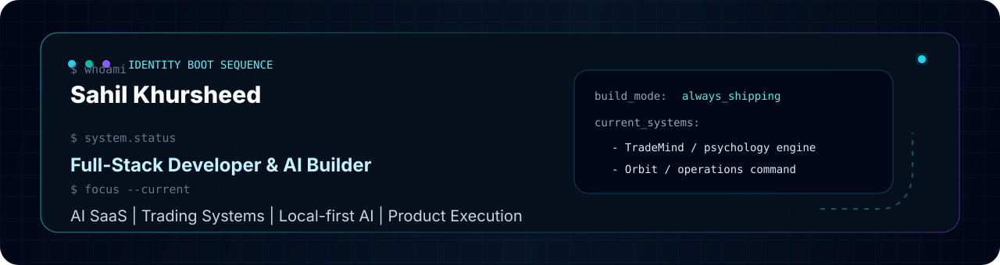
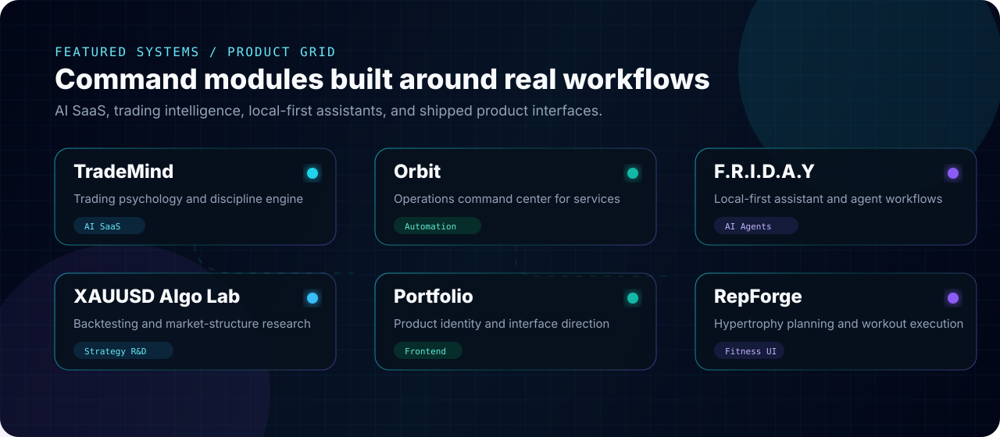

<div align="center">



<br />


</div>

---

## System Boot



```bash
$ whoami
Sahil Khursheed

$ system.status
Full-Stack Developer & AI Builder

$ focus --current
AI SaaS | Trading Systems | Local-first AI | Product Execution
```

```yaml
name: Sahil Khursheed
handle: igris-cmyk
location: Kashmir, India
build_mode: always_shipping
focus:
  - AI-powered SaaS products
  - trading intelligence systems
  - local-first AI assistants
  - full-stack product execution
current_systems:
  trademind: trader psychology + discipline engine
  orbit: operations command center for service businesses
  friday: local-first AI assistant
  xauusd_algo_lab: trading research + strategy testing
```

---

## Featured Systems



<table>
  <tr>
    <td width="50%" valign="top">
      <h3><a href="https://trade-mind-alpha.vercel.app/">TradeMind</a></h3>
      <p>AI-powered trading journal for psychology tracking, execution review, discipline scoring, and trader behavior analysis.</p>
      <p><code>AI SaaS</code> <code>Trading Psychology</code> <code>Next.js</code> <code>Prisma</code> <code>Neon</code></p>
    </td>
    <td width="50%" valign="top">
      <h3><a href="https://orbit-sage-eta.vercel.app/">Orbit</a></h3>
      <p>Unified operations command center for service businesses: leads, inbox, bookings, forms, inventory, staff, alerts, automations, and business health.</p>
      <p><code>SaaS</code> <code>Operations</code> <code>Dashboard</code> <code>Automation</code></p>
    </td>
  </tr>
  <tr>
    <td width="50%" valign="top">
      <h3><a href="https://github.com/igris-cmyk/F.R.I.D.A.Y">F.R.I.D.A.Y</a></h3>
      <p>Local-first AI assistant with agents, memory, routing, terminal workflows, research workflows, and desktop assistant concepts.</p>
      <p><code>AI Agents</code> <code>FastAPI</code> <code>LangGraph</code> <code>Tauri</code> <code>Local LLMs</code></p>
    </td>
    <td width="50%" valign="top">
      <h3><a href="https://github.com/igris-cmyk/xauusd_algo_lab">XAUUSD Algo Lab</a></h3>
      <p>Algorithmic trading research lab for XAUUSD strategy testing, VWAP logic, backtesting, and market-structure research.</p>
      <p><code>Python</code> <code>Backtesting</code> <code>XAUUSD</code> <code>Strategy Research</code></p>
    </td>
  </tr>
  <tr>
    <td width="50%" valign="top">
      <h3><a href="https://my-portfolio-dusky-six-24.vercel.app/">Portfolio</a></h3>
      <p>Personal developer portfolio showcasing projects, interface direction, and product-building identity.</p>
      <p><code>Frontend</code> <code>Portfolio</code> <code>UI</code> <code>Deployment</code></p>
    </td>
    <td width="50%" valign="top">
      <h3><a href="https://repforge1.vercel.app/">RepForge</a></h3>
      <p>Fitness-focused PPL interface for hypertrophy programming, structured planning, and workout execution.</p>
      <p><code>React</code> <code>TypeScript</code> <code>Vite</code> <code>Tailwind</code></p>
    </td>
  </tr>
</table>

---

## System Modules

<table>
  <tr>
    <td width="50%" valign="top">
      <h3>Interface Layer</h3>
      
      <p><code>Product UI</code> <code>Responsive systems</code> <code>Dashboard interfaces</code></p>
    </td>
    <td width="50%" valign="top">
      <h3>Backend Layer</h3>
      
      <p><code>APIs</code> <code>Data models</code> <code>Auth flows</code></p>
    </td>
  </tr>
  <tr>
    <td width="50%" valign="top">
      <h3>Intelligence Layer</h3>
      <p>
        
        
        
      </p>
      <p><code>Local LLM workflows</code> <code>Automation</code> <code>Trading analytics</code></p>
    </td>
    <td width="50%" valign="top">
      <h3>Deployment & Tools</h3>
      
      <p><code>Shipping loops</code> <code>CLI workflows</code> <code>Hosted products</code></p>
    </td>
  </tr>
</table>

---

## GitHub Telemetry

<div align="center">


<br />


<br />


<br />

<picture>
  <source media="(prefers-color-scheme: dark)" srcset="https://raw.githubusercontent.com/igris-cmyk/igris-cmyk/output/github-contribution-grid-snake.svg" />
  
</picture>

</div>

---

## Build Philosophy

```txt
From idea -> architecture -> interface -> backend -> intelligence layer -> deployment.

I build products like systems:
clear flows, clean interfaces, useful AI, and real-world deployability.
```

```txt
I build full-stack products where clean interfaces, useful AI, and real-world workflows meet.
```

<div align="center">

**From idea to deployed product.**

</div>

---

## Contact / Network Panel

<div align="center">

<a href="https://github.com/igris-cmyk">
  
</a>
<a href="https://my-portfolio-dusky-six-24.vercel.app/">
  
</a>
<a href="mailto:prammer711@gmail.com">
  
</a>
<a href="https://www.linkedin.com/in/sahil-khursheed-419666413">
  
</a>
<a href="https://www.instagram.com/s_ahi_.l/">
  
</a>

</div>

---

<div align="center">


**Always shipping.**

</div>
